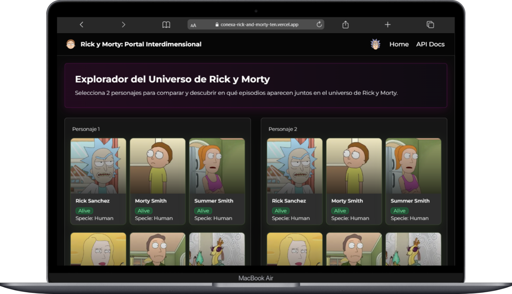
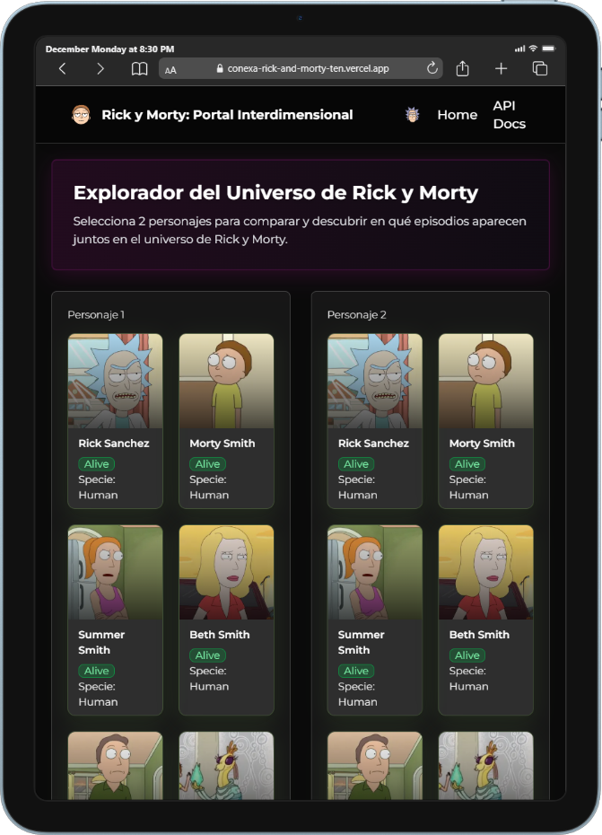
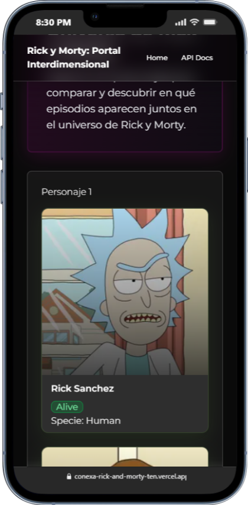
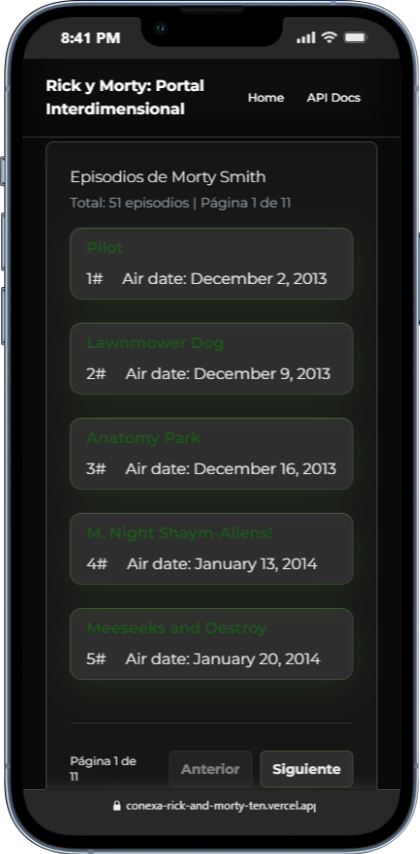

This is a [Next.js](https://nextjs.org) project bootstrapped with [`create-next-app`](https://nextjs.org/docs/app/api-reference/cli/create-next-app).

# Rick and Morty Character Comparison App

Aplicación Next.js 15 para comparar personajes de Rick and Morty, ver episodios compartidos y explorar la API oficial.

---

## Tecnologías y Patrones

| Tecnología                         | Uso                   | Por qué                                        |
| ---------------------------------- | --------------------- | ---------------------------------------------- |
| **Next.js 15**                     | Framework principal   | App Router, Server Components, TypeScript      |
| **Zustand**                        | Estado global         | Manejo de personajes seleccionados y filtros   |
| **CVA** (Class Variance Authority) | Estilos con variantes | Sistema de diseño consistente y tipado         |
| **Tailwind CSS**                   | Styling               | Utility-first CSS con breakpoints responsive   |
| **Vitest**                         | Testing               | Más rápido que Jest, compatible con TypeScript |
| **TypeScript**                     | Tipado estático       | Sin `any`, tipos completos en toda la app      |

## Arquitectura de Mappers

```
┌─────────────┐      ┌─────────┐      ┌──────────┐
│  API Rick   │ ───► │ Mapper  │ ───► │   DTO    │
│  & Morty    │      │         │      │ (interno)│
└─────────────┘      └─────────┘      └──────────┘
  status: "Alive"                      status: "alive"
  air_date: "..."                      airDate: "..."
```

---

## Comandos de testing

```bash
npm test                # Corre todos los tests
npm test -- --ui        # Abre interfaz visual
npm run test:coverage   # Genera reporte de cobertura
npm test CharacterCard  # Corre solo un archivo
```

## URL del proyecto

https://conexa-rick-and-morty-ten.vercel.app/

## Demo


## Screenshots

<div align="center">

### Desktop



### Responsive Views




### Episodios Compartidos



</div>
